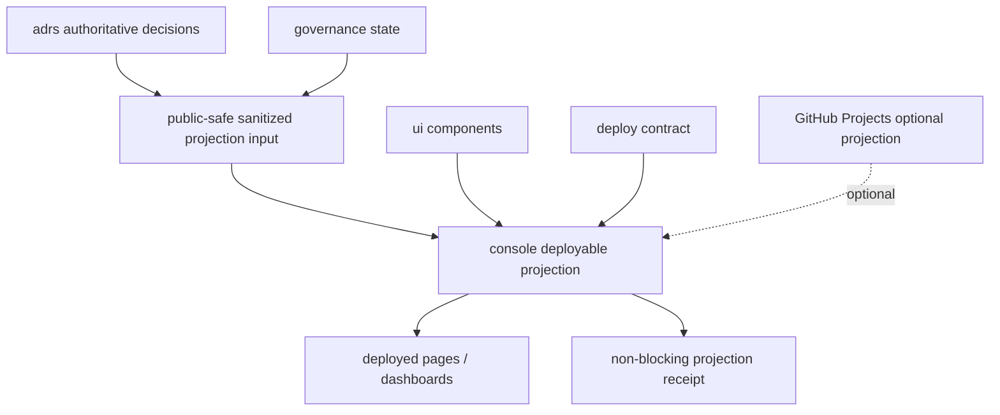

# console

console deploys visualization of externally authoritative state; it does not define that state.

## Purpose

`roccho-dev/console` is the deployable visualization surface for ADRS and governance state.
It turns public-safe, sanitized projection inputs into deployed pages, dashboards, and optional GitHub Projects views.

`console` is a projection surface. It is not a source of truth.

## Current boundary

`console` is not in the selected real package closure yet.

The following are **projection only**:

- this README
- deployed pages
- screenshots
- GitHub Projects views
- generated dashboards
- generated artifacts
- projection receipts emitted from this repository

These surfaces may help a reader navigate state, but they do not accept, reject, supersede, certify, or close governance state.

## Dependency map

| Dependency | Authority remains in | `console` role | Boundary |
|---|---|---|---|
| `roccho-dev/adrs` | ADRS | read ADR / decision / source-state projection inputs | render and link only |
| `roccho-dev/governance` | governance | expose non-blocking projection receipts for observation | do not become final evidence |
| `roccho-dev/ui` | UI repo | consume reusable visualization components | do not define component authority |
| `roccho-dev/deploy` | deploy repo | consume deployment policy / runtime integration contracts | do not define deployment authority |
| GitHub Projects | optional external projection | optional Kanban / roadmap source or sink | never required for correctness |

## Projection flow



## Placeholder data contract

The placeholder input shape lives at:

- `docs/contracts/console-visualization-input.v0.jsonl`

The non-blocking README projection receipt lives at:

- `docs/receipts/console-readme-projection.receipt.jsonl`

Both files are projection contracts only. They do not make `console` authoritative. The accepted contract authority remains pending in `roccho-dev/adrs#187`; governance observation is expected to remain non-blocking in `roccho-dev/governance#134`.

## Public / private output boundary

This repository is public. Fixtures, receipts, generated outputs, screenshots, GitHub Projects projections, and deployed pages must not include:

- private ADR content
- private issue content
- secrets
- credentials
- internal-only evidence
- unsanitized source records

Only public-safe, sanitized projection data may be committed or deployed from this repository.

## What `console` must not claim

`console` must not claim to be:

- ADR authority
- work-ledger authority
- UI component authority
- deployment authority
- closure certificate authority
- required GitHub Projects authority
- final governance evidence

## Local check

Run:

```sh
python tools/check-console-boundary.py
```

The check keeps the README, placeholder contract, and non-blocking receipt aligned with this boundary.
